---

layout: post

title: Aarti[aj177] - Project

description: blog post

Tags: Project

---

#Art: Success + Surveillance
###Motivation
Assisted reproductive technology (ART) are methods used to achieve pregnancy by artificial or partially artificial means. Today, over 1% of all infants born in the United States every year are conceived using ART.

According to the CDC definition, **ART** includes all fertility treatments in which both eggs and sperm are handled. In general, ART procedures involve surgically removing eggs from a woman’s ovaries, combining them with sperm in the laboratory, and returning them to the woman’s body or donating them to another woman.

###Data Munging
Data was indeed ugly!

Data preparation was the most time and labor-intensive process.

I used a combination of python(pandas) + excel for data wrangling.

I elected to viz + analyze data on a **national level** to glean macro trends. CDC data is available granularly on a state and city level.

| Challenges 					| Solutions 
| ---------- 					|  --------
|raw data in excel format 		| used an excel to CSV converter
|some fields in % format		| convert to decimal format
|lack of "=" for fractions 		| implemented an excel macro to prevent conversion to date format
|  field selection: 51/202		| discovered the joy of regex manipulation! 
| concatenate annual data files with non-matching columns | manual inspection + execution
| inconsistent reporting		| 1)certain years had single + triplet birth reported, certain had single and multiple infant birth 2) omitted years 2011 and 2012 in surveillance metrics since cxld rates not reported  

**Code excerpt from munging in Python**
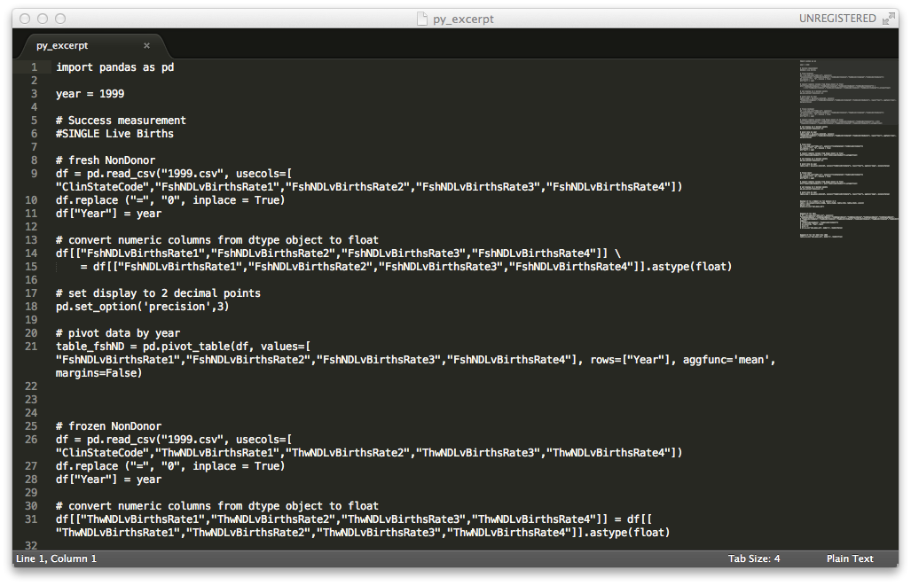
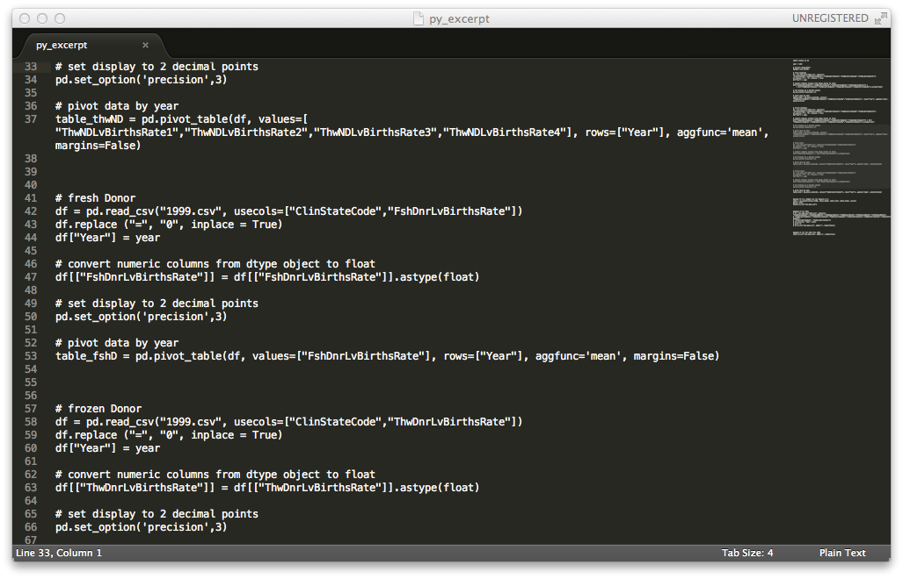
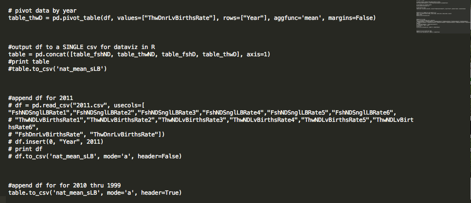

###Treatment of missing data

**Missing Not at Random(MNAR)**

CDC intially collated data for age groups <35, 35-37, 37-40, 40-42 and later began to add data for groups of 42-44, and 44-46 Since missing age groups is MNAR, I decided to use mean substitution for this data field.

**Missing at Random(MAR)**

For reported groups, where the the values are omitted at random, I used listwise deletion.

I used ddplyr for the aforementioned operations. In the future, I would like to explore the relative merits of ddplyr vs data munging in Python.

###Charts 
I used R for data viz + statistical analysis. In particular, I used 
1) ggplot2
2) lattice
3) KernSmooth
4) glm

#####Success metrics

#####**Graph1**
Count of ART Cycles by Age, by Egg Type
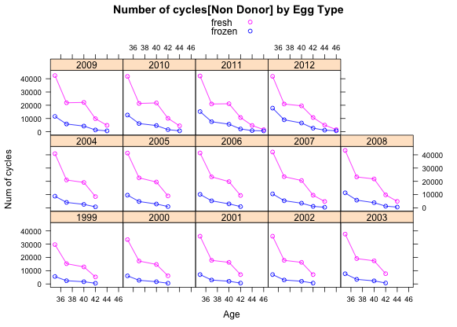

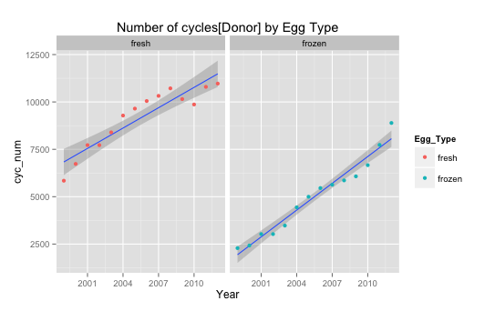

#####**Graph2**
Count of singleton live births by Age, by Egg Type
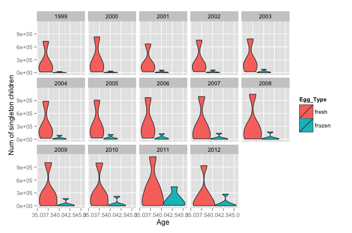

I used a violin density plot to convey the summary of this distribution. I changed the default to **equal width**. 

#####**Graph3**
Distribution of singleton live births as a proxy for fertility rates.
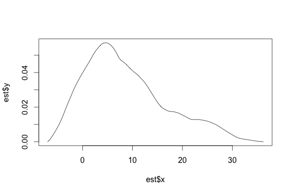

I researched literature and found that fertility rates, as a function of Age, are well represented by a beta or gamma distribution. In the, graph above I used the KernSmooth package and the Epanechnikov kernel to viz the population of singleton live births, as a function of women's age.

#####Surveillance metrics 

#####**Graph4**
Surveillance for fresh NonDonor Egg by metric
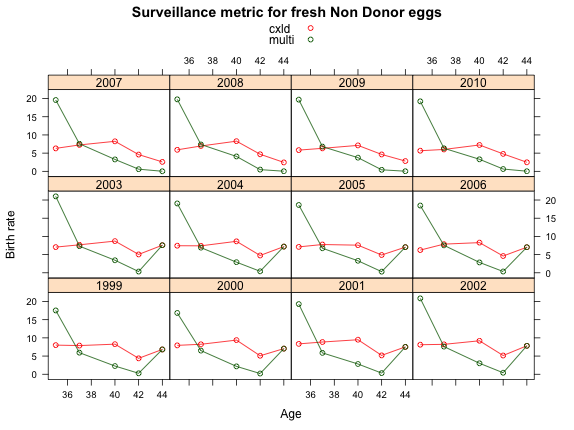

#####**Graph5**
Distribution of multiple-infant live births as a representation of fertility rates.
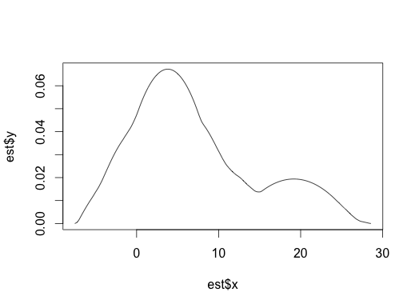

I used the Epanechnikov kernel to viz multiple-infant births as well but perhaps this requires future investigation 

#####**Graph6**
Distribution of cancelled ART cycles by Age, by Egg Type
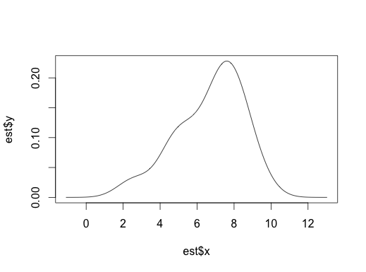

Based on visual inspection, I used the Gaussian kernel to viz cancellation  rates but I would like to investigate if it is better fitted by lognormal density.

###GLM analysis
Success metric: I used Gamma distribution for the singleton live births as a function of log(Age)
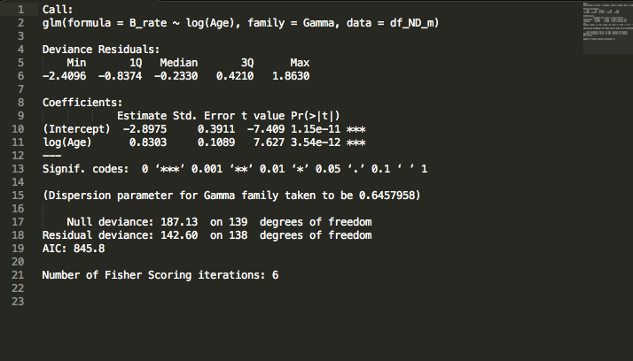

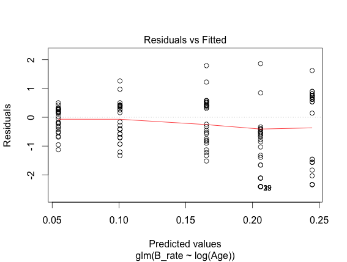

###Overall insights
Next step: interpret graphs + GLM analysis and gain some insight
